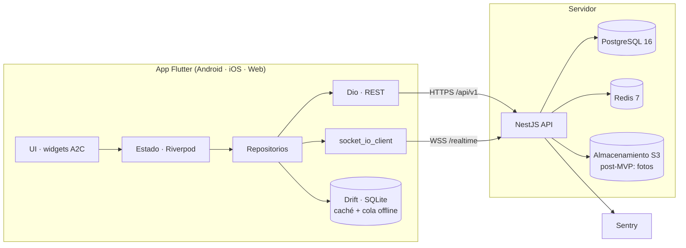
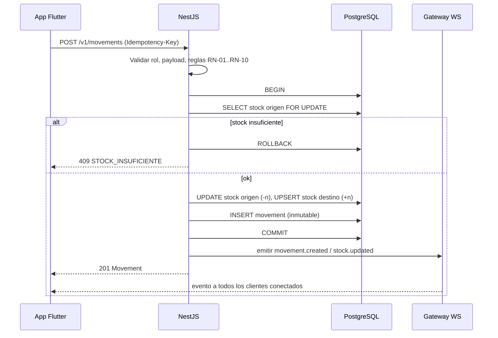
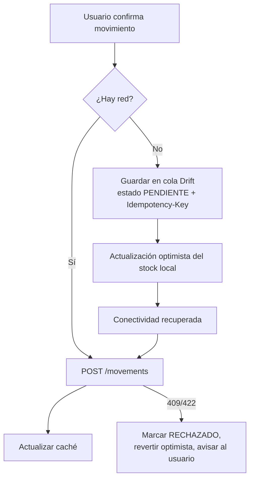
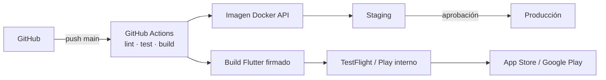

# 04 — Arquitectura de Software

---

## 1. Resumen

**Cliente multiplataforma en Flutter** (Android e iOS en el MVP; web para el panel de administración después) que consume una **API REST + WebSocket en NestJS**, con **PostgreSQL** como base de datos y **Redis** para tiempo real y límites de tasa.



## 2. Stack

| Capa                 | Tecnología                                    | Motivo                                                              |
| -------------------- | --------------------------------------------- | ------------------------------------------------------------------- |
| App                  | **Flutter 3.x / Dart 3**                       | Un solo código para Android, iOS y web; animaciones fluidas a 60 fps |
| Estado               | **Riverpod 3** (`riverpod_generator`)          | Estado reactivo, testeable, sin `BuildContext`                      |
| Navegación           | **go_router**                                  | Rutas declarativas, deep links, guardas por sesión                  |
| HTTP                 | **Dio** + interceptores                        | Refresh de token, reintentos, `Idempotency-Key`                     |
| Modelos              | **freezed** + **json_serializable**            | Inmutabilidad y serialización generada                              |
| Persistencia local   | **Drift** (SQLite)                             | Caché consultable y cola offline transaccional                      |
| Almacén seguro       | **flutter_secure_storage**                     | Tokens en Keychain/Keystore                                         |
| Tiempo real          | **socket_io_client**                           | Compatible con el gateway de NestJS                                  |
| Mapas                | **flutter_map** + OpenStreetMap **[POR CONFIRMAR]** | Funciona en móvil y web sin costo; alternativa: `google_maps_flutter` |
| Tipografía           | **Geist** (fuente empaquetada, licencia OFL)   | Identidad visual A2C                                                |
| i18n                 | **intl** + ARB                                 | Textos en español externalizados                                    |
| API                  | **NestJS 11** (Node 22, TypeScript)            | Modular, guardas, validación, WebSocket integrado                   |
| ORM                  | **Prisma 6**                                   | Migraciones versionadas y tipado                                    |
| Base de datos        | **PostgreSQL 16**                              | Transacciones, restricciones `CHECK`, bloqueo por fila               |
| Caché / pub-sub      | **Redis 7**                                    | Adaptador Socket.IO, rate limit, tokens revocados                   |
| Contrato             | **OpenAPI 3** (`@nestjs/swagger`) → cliente Dart generado | Una fuente de verdad entre API y app                                |
| Observabilidad       | Sentry, logs JSON (pino), `/health`            | Diagnóstico de errores en app y servidor                            |
| CI/CD                | GitHub Actions + Codemagic/Fastlane **[POR CONFIRMAR]** | Pruebas, builds firmados y publicación en tiendas         |
| Infraestructura      | Docker; VPS o PaaS (Railway/Render/Fly) **[POR CONFIRMAR]** | Costo bajo para el volumen del MVP                     |

## 3. Arquitectura de la app Flutter

Estructura **por funcionalidad** (feature-first) con capas internas:

```
lib/
  core/        # tema A2C, router, cliente HTTP, errores, utilidades
  features/
    welcome/   # splash animado + onboarding
    auth/      # ingreso, sesión
    dashboard/ # panel en tiempo real
    sites/     # obras y almacén
    assets/    # catálogo de activos
    movements/ # mover/asignar, historial
    users/     # usuarios
  shared/      # widgets reutilizables A2C
```

Cada funcionalidad tiene:

| Capa            | Responsabilidad                                         | Ejemplo                               |
| --------------- | ------------------------------------------------------- | ------------------------------------- |
| `presentation/` | Pantallas, widgets, controladores (Riverpod Notifiers)  | `MoveAssetScreen`, `MoveAssetController` |
| `domain/`       | Entidades y reglas puras de Dart (sin Flutter)           | `MovementRules.validate()`             |
| `data/`         | Repositorios, DTO, fuentes remota (Dio) y local (Drift)  | `MovementsRepository`                  |

**Regla:** las reglas de negocio de stock (RN-01, RN-02, RN-03) se validan en la app para dar feedback inmediato, pero **la fuente de verdad es el servidor**.

## 4. Arquitectura de la API NestJS

Módulos por dominio:

| Módulo        | Responsabilidad                                                     |
| ------------- | ------------------------------------------------------------------- |
| `auth`        | Ingreso por DNI, emisión/rotación de tokens, bloqueo por intentos   |
| `users`       | CRUD de usuarios, roles, restablecer contraseña                     |
| `sites`       | Obras y almacén (ubicaciones)                                       |
| `assets`      | Catálogo, códigos, estados, notas                                   |
| `movements`   | Movimientos atómicos, historial, reversiones, observaciones         |
| `dashboard`   | Resumen agregado del inventario                                     |
| `realtime`    | Gateway Socket.IO, salas, emisión de eventos                        |
| `audit`       | Registro de acciones administrativas                                |
| `health`      | Liveness / readiness                                                |

Capas transversales: `ValidationPipe` (class-validator), guardas `JwtAuthGuard` + `RolesGuard`, filtro de excepciones con formato `application/problem+json`, interceptor de `requestId`, `ThrottlerGuard` respaldado por Redis.

## 5. Flujo crítico: registrar un movimiento



- El bloqueo `SELECT … FOR UPDATE` sobre la fila de stock del origen evita stock negativo con movimientos simultáneos.
- La restricción `CHECK (cantidad >= 0)` en la base es la última línea de defensa.
- La clave de idempotencia (única por usuario) hace seguros los reintentos de la cola offline.

## 6. Tiempo real

- Al conectarse, el cliente se autentica con el access token en el handshake.
- Salas: `inventory` (todos), `site:{id}` (detalle de una obra), `asset:{id}` (detalle de un activo).
- Eventos emitidos tras `COMMIT`: `movement.created`, `stock.updated`, `asset.updated`, `site.updated`.
- Con varias instancias de API se usa `@socket.io/redis-adapter`.
- La app reconecta con backoff exponencial; al reconectar pide un **resync** (`GET /v1/dashboard?since=`).

## 7. Sin conexión



## 8. Despliegue



Entornos: `local` (Docker Compose), `staging`, `production`. Variables por entorno con `--dart-define` en Flutter y `.env` en la API.

## 9. Registro de decisiones (ADR)

| ID     | Decisión                                                     | Alternativas descartadas             | Motivo                                                    |
| ------ | ------------------------------------------------------------ | ------------------------------------ | --------------------------------------------------------- |
| ADR-01 | **Flutter** para el cliente multiplataforma                  | React Native, nativo x2              | Un código para Android/iOS/web, rendimiento de animaciones, decisión del cliente |
| ADR-02 | **NestJS + Prisma + PostgreSQL** para la API                 | Firebase, Supabase                   | Control de transacciones de stock, experiencia previa del equipo |
| ADR-03 | **Ubicación unificada** (obra y almacén en una tabla)        | Tablas separadas                     | Un solo modelo de stock y movimientos                     |
| ADR-04 | **Movimientos inmutables** + stock materializado             | Calcular stock sumando movimientos   | Lecturas rápidas; consistencia vía transacción y verificación nocturna |
| ADR-05 | **REST + Socket.IO** (no GraphQL)                            | GraphQL + subscriptions              | Simplicidad, compatibilidad con el stack conocido         |
| ADR-06 | **Drift** para caché y cola offline                          | Hive, Isar, shared_preferences       | SQL relacional, transacciones, migraciones                |
| ADR-07 | **Riverpod** para estado                                     | Bloc, Provider                       | Menos boilerplate, generación de código, testeable        |
| ADR-08 | Animación del logo con **CustomPainter + AnimationController** | Lottie, Rive, video                | Sin dependencias, nítido en cualquier resolución, controla "reducir movimiento" |
| ADR-09 | Ingreso por **DNI + contraseña** (sin correo)                | Correo / OTP SMS                     | Así lo definió el boceto; el personal de obra no siempre usa correo |
| ADR-10 | **Dos roles (ADMIN, OPERADOR) sin permisos por obra**        | Tres roles con acceso por obra       | Decisión de A2C: el operador ejecuta los traslados sin aprobación y reporta observaciones; el administrador administra y supervisa |
| ADR-11 | **Repositorios Dio escritos a mano** (sin cliente generado) | Cliente Dart generado desde OpenAPI | La API es pequeña; el código generado añadía un paso de build sin beneficio. Se reevalúa si supera ~30 endpoints |
