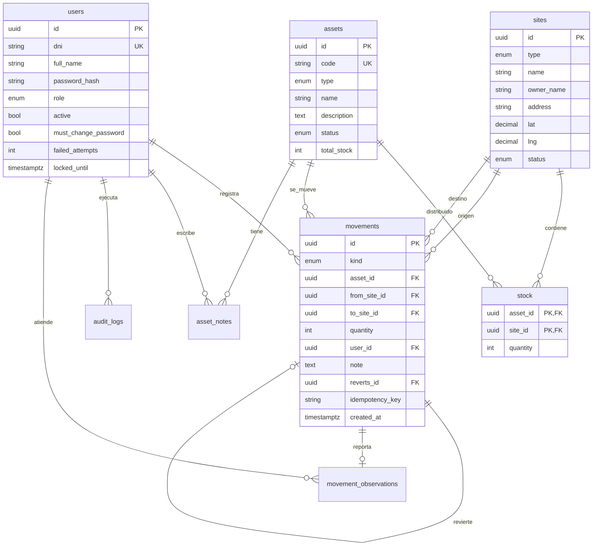

# 05 — Modelo de Datos

> Basado en el boceto original (tablas **OBRA_ACTIVO**, **ACTIVO**, **obra**, **usuario**) y normalizado para soportar stock por ubicación e historial inmutable.

---

## 1. Correspondencia con el boceto

| Boceto                                              | Modelo                                                     |
| --------------------------------------------------- | ---------------------------------------------------------- |
| `ACTIVO`: código, tipo (máquina/herramienta), nombre, descripción, estado (mantenimiento/operativo/baja), stock | `assets` |
| "Si es máquina → 1; si es herramienta → el usuario especifica la cantidad que va a mover" | `assets.type` + `CHECK` + reglas de `movements` |
| `obra`: dueño, ubicación (maps), nombre             | `sites` (tipo `OBRA`)                                      |
| Almacén                                             | `sites` (tipo `ALMACEN`)                                   |
| `OBRA_ACTIVO`: activo, obra, cantidad               | `stock` (cantidad actual por activo y ubicación)           |
| `OBRA_ACTIVO`: usuario, qué hizo el cambio          | `movements` (historial inmutable)                          |
| `usuario`: DNI, nombre, contraseña                  | `users` (+ rol)                                            |
| Notas                                               | `asset_notes`                                              |
| Observaciones del operador al trasladar             | `movement_observations` (abierta → atendida)               |

## 2. Diagrama entidad-relación



## 3. Esquema Prisma (`apps/api/prisma/schema.prisma`)

```prisma
generator client {
  provider = "prisma-client-js"
}

datasource db {
  provider = "postgresql"
  url      = env("DATABASE_URL")
}

enum Role {
  ADMIN     // consulta, valida disponibilidad, gestiona usuarios/obras/catálogo
  OPERADOR  // ejecuta y registra los traslados entre cualquier obra y el almacén
}

enum SiteType {
  ALMACEN
  OBRA
}

enum SiteStatus {
  ACTIVA
  CERRADA
}

enum AssetType {
  MAQUINA
  HERRAMIENTA
}

enum AssetStatus {
  OPERATIVO
  MANTENIMIENTO
  BAJA
}

enum ObservationType {
  DANADO
  INCOMPLETO
  FALTANTE
  OTRO
}

enum ObservationStatus {
  ABIERTA
  ATENDIDA
}

enum MovementKind {
  ALTA       // ingreso al inventario (sin origen)
  TRASLADO   // origen -> destino
  BAJA       // retiro definitivo (sin destino)
  AJUSTE     // corrección de conteo con motivo
  REVERSION  // inverso de un movimiento previo
}

model User {
  id                 String    @id @default(uuid()) @db.Uuid
  dni                String    @unique @db.VarChar(8)
  fullName           String    @map("full_name") @db.VarChar(120)
  passwordHash       String    @map("password_hash")
  role               Role      @default(OPERADOR)
  active             Boolean   @default(true)
  mustChangePassword Boolean   @default(true) @map("must_change_password")
  tempPasswordExpiresAt DateTime? @map("temp_password_expires_at") @db.Timestamptz // contraseña temporal: 72 h (docs/07 §2)
  failedAttempts     Int       @default(0) @map("failed_attempts")
  lockedUntil        DateTime? @map("locked_until") @db.Timestamptz
  lastLoginAt        DateTime? @map("last_login_at") @db.Timestamptz
  createdAt          DateTime  @default(now()) @map("created_at") @db.Timestamptz
  updatedAt          DateTime  @updatedAt @map("updated_at") @db.Timestamptz

  movements     Movement[]
  notes         AssetNote[]
  auditLogs     AuditLog[]
  refreshTokens RefreshToken[]
  observationsResolved MovementObservation[] @relation("ObservationResolver")

  @@map("users")
}

model RefreshToken {
  id         String    @id @default(uuid()) @db.Uuid
  userId     String    @map("user_id") @db.Uuid
  tokenHash  String    @unique @map("token_hash")
  familyId   String    @map("family_id") @db.Uuid
  deviceName String?   @map("device_name")
  expiresAt  DateTime  @map("expires_at") @db.Timestamptz
  revokedAt  DateTime? @map("revoked_at") @db.Timestamptz
  createdAt  DateTime  @default(now()) @map("created_at") @db.Timestamptz

  user User @relation(fields: [userId], references: [id], onDelete: Cascade)

  @@index([userId])
  @@map("refresh_tokens")
}

model Site {
  id        String     @id @default(uuid()) @db.Uuid
  type      SiteType
  name      String     @db.VarChar(120)
  ownerName String?    @map("owner_name") @db.VarChar(120)
  address   String?    @db.VarChar(200)
  lat       Decimal?   @db.Decimal(9, 6)
  lng       Decimal?   @db.Decimal(9, 6)
  status    SiteStatus @default(ACTIVA)
  createdAt DateTime   @default(now()) @map("created_at") @db.Timestamptz
  updatedAt DateTime   @updatedAt @map("updated_at") @db.Timestamptz

  stock         Stock[]
  movementsFrom Movement[] @relation("MovementFrom")
  movementsTo   Movement[] @relation("MovementTo")

  @@index([type, status])
  @@map("sites")
}

model Asset {
  id          String      @id @default(uuid()) @db.Uuid
  code        String      @unique @db.VarChar(12)
  type        AssetType
  name        String      @db.VarChar(120)
  description String?
  status      AssetStatus @default(OPERATIVO)
  totalStock  Int         @map("total_stock")
  createdAt   DateTime    @default(now()) @map("created_at") @db.Timestamptz
  updatedAt   DateTime    @updatedAt @map("updated_at") @db.Timestamptz

  stock        Stock[]
  movements    Movement[]
  notes        AssetNote[]
  observations MovementObservation[]

  @@index([type, status])
  @@index([name])
  @@map("assets")
}

model Stock {
  assetId   String   @map("asset_id") @db.Uuid
  siteId    String   @map("site_id") @db.Uuid
  quantity  Int
  updatedAt DateTime @updatedAt @map("updated_at") @db.Timestamptz

  asset Asset @relation(fields: [assetId], references: [id])
  site  Site  @relation(fields: [siteId], references: [id])

  @@id([assetId, siteId])
  @@index([siteId])
  @@map("stock")
}

model Movement {
  id             String       @id @default(uuid()) @db.Uuid
  kind           MovementKind
  assetId        String       @map("asset_id") @db.Uuid
  fromSiteId     String?      @map("from_site_id") @db.Uuid
  toSiteId       String?      @map("to_site_id") @db.Uuid
  quantity       Int
  userId         String       @map("user_id") @db.Uuid
  note           String?      @db.VarChar(500)
  revertsId      String?      @unique @map("reverts_id") @db.Uuid
  idempotencyKey String       @map("idempotency_key") @db.VarChar(64)
  createdAt      DateTime     @default(now()) @map("created_at") @db.Timestamptz

  asset    Asset     @relation(fields: [assetId], references: [id])
  fromSite Site?     @relation("MovementFrom", fields: [fromSiteId], references: [id])
  toSite   Site?     @relation("MovementTo", fields: [toSiteId], references: [id])
  user     User      @relation(fields: [userId], references: [id])
  reverts  Movement? @relation("Reversion", fields: [revertsId], references: [id])
  revertedBy Movement? @relation("Reversion")
  observation MovementObservation?

  @@unique([userId, idempotencyKey])
  @@index([assetId, createdAt(sort: Desc)])
  @@index([fromSiteId, createdAt(sort: Desc)])
  @@index([toSiteId, createdAt(sort: Desc)])
  @@map("movements")
}

model AssetNote {
  id        String   @id @default(uuid()) @db.Uuid
  assetId   String   @map("asset_id") @db.Uuid
  userId    String   @map("user_id") @db.Uuid
  body      String   @db.VarChar(1000)
  createdAt DateTime @default(now()) @map("created_at") @db.Timestamptz

  asset Asset @relation(fields: [assetId], references: [id])
  user  User  @relation(fields: [userId], references: [id])

  @@index([assetId, createdAt(sort: Desc)])
  @@map("asset_notes")
}

// RN-15: observación reportada por el operador durante un traslado.
// Es una tabla aparte porque `movements` es inmutable y la observación cambia de estado.
model MovementObservation {
  id           String            @id @default(uuid()) @db.Uuid
  movementId   String            @unique @map("movement_id") @db.Uuid
  assetId      String            @map("asset_id") @db.Uuid
  type         ObservationType
  description  String            @db.VarChar(500)
  status       ObservationStatus @default(ABIERTA)
  resolvedById String?           @map("resolved_by_id") @db.Uuid
  resolvedAt   DateTime?         @map("resolved_at") @db.Timestamptz
  resolution   String?           @db.VarChar(500)
  createdAt    DateTime          @default(now()) @map("created_at") @db.Timestamptz

  movement   Movement @relation(fields: [movementId], references: [id])
  asset      Asset    @relation(fields: [assetId], references: [id])
  resolvedBy User?    @relation("ObservationResolver", fields: [resolvedById], references: [id])

  @@index([status, createdAt(sort: Desc)])
  @@index([assetId])
  @@map("movement_observations")
}

model CodeSequence {
  prefix    String @id @db.VarChar(4) // "MAQ" | "HER"
  lastValue Int    @default(0) @map("last_value")

  @@map("code_sequences")
}

model AuditLog {
  id         String   @id @default(uuid()) @db.Uuid
  userId     String   @map("user_id") @db.Uuid
  action     String   @db.VarChar(60) // p. ej. USER_CREATED, ASSET_STATUS_CHANGED
  entityType String   @map("entity_type") @db.VarChar(30)
  entityId   String   @map("entity_id") @db.Uuid
  before     Json?
  after      Json?
  ip         String?  @db.VarChar(45)
  createdAt  DateTime @default(now()) @map("created_at") @db.Timestamptz

  user User @relation(fields: [userId], references: [id])

  @@index([entityType, entityId])
  @@index([userId, createdAt(sort: Desc)])
  @@map("audit_logs")
}
```

## 4. Restricciones SQL adicionales (migración manual)

Prisma no expresa todas las reglas; se agregan en una migración SQL:

```sql
-- Stock nunca negativo
ALTER TABLE stock ADD CONSTRAINT stock_quantity_non_negative CHECK (quantity >= 0);

-- Movimientos con cantidad positiva
ALTER TABLE movements ADD CONSTRAINT movements_quantity_positive CHECK (quantity > 0);

-- RN-03: origen distinto de destino
ALTER TABLE movements ADD CONSTRAINT movements_from_to_distinct
  CHECK (from_site_id IS NULL OR to_site_id IS NULL OR from_site_id <> to_site_id);

-- Forma de cada tipo de movimiento
ALTER TABLE movements ADD CONSTRAINT movements_kind_shape CHECK (
  (kind = 'ALTA'      AND from_site_id IS NULL     AND to_site_id IS NOT NULL) OR
  (kind = 'BAJA'      AND from_site_id IS NOT NULL AND to_site_id IS NULL)     OR
  (kind IN ('TRASLADO','REVERSION') AND from_site_id IS NOT NULL AND to_site_id IS NOT NULL) OR
  (kind = 'AJUSTE')
);

-- RN-01: una máquina tiene stock total 1 (o 0 si está dada de baja)
ALTER TABLE assets ADD CONSTRAINT assets_machine_unit CHECK (
  type <> 'MAQUINA' OR total_stock IN (0, 1)
);

-- DNI peruano de 8 dígitos (RN-11)
ALTER TABLE users ADD CONSTRAINT users_dni_format CHECK (dni ~ '^[0-9]{8}$');

-- Movimientos inmutables: bloquear UPDATE y DELETE
CREATE OR REPLACE FUNCTION forbid_movement_changes() RETURNS trigger AS $$
BEGIN
  RAISE EXCEPTION 'movements es inmutable';
END; $$ LANGUAGE plpgsql;

CREATE TRIGGER movements_immutable
  BEFORE UPDATE OR DELETE ON movements
  FOR EACH ROW EXECUTE FUNCTION forbid_movement_changes();

-- Búsqueda por nombre (insensible a mayúsculas y acentos)
CREATE EXTENSION IF NOT EXISTS unaccent;
CREATE EXTENSION IF NOT EXISTS pg_trgm;
-- unaccent() no es IMMUTABLE; este envoltorio permite usarlo en un índice.
CREATE OR REPLACE FUNCTION immutable_unaccent(text) RETURNS text
  LANGUAGE sql IMMUTABLE PARALLEL SAFE STRICT
  AS $$ SELECT public.unaccent('public.unaccent', $1) $$;
CREATE INDEX assets_name_trgm ON assets USING gin (lower(immutable_unaccent(name)) gin_trgm_ops);
```

## 5. Generación de códigos (RN-08)

```sql
-- Dentro de la transacción de alta:
UPDATE code_sequences SET last_value = last_value + 1
 WHERE prefix = $1 RETURNING last_value;
-- code = prefix || '-' || lpad(last_value::text, 4, '0')   → HER-0143
```

El `UPDATE … RETURNING` serializa el acceso y evita códigos duplicados.

## 6. Invariantes verificados cada noche

```sql
-- 1) total_stock = suma del stock por ubicación
SELECT a.code FROM assets a
LEFT JOIN stock s ON s.asset_id = a.id
GROUP BY a.id HAVING a.total_stock <> COALESCE(SUM(s.quantity), 0);

-- 2) stock por ubicación = entradas - salidas registradas en movements
-- (consulta completa en apps/api/src/jobs/stock-integrity.job.ts)
```

Cualquier discrepancia genera una alerta en Sentry (RNF-DI-04).

## 7. Datos semilla

| Entidad        | Semilla                                                                 |
| -------------- | ----------------------------------------------------------------------- |
| `sites`        | "Almacén central" (`ALMACEN`)                                           |
| `users`        | 1 administrador inicial (DNI y contraseña temporal desde variables de entorno) |
| `code_sequences` | `MAQ` = 0, `HER` = 0                                                  |
| Demo (solo dev) | 3 obras, 11 activos y los movimientos de ejemplo del canvas de diseño  |

## 8. Retención

| Dato             | Retención                                   |
| ---------------- | ------------------------------------------- |
| `movements`      | Indefinida (historial auditable)            |
| `audit_logs`     | 5 años                                      |
| `refresh_tokens` | Se eliminan 30 días después de expirar      |
| Usuarios inactivos | Se conservan (integridad del historial); datos personales anonimizables a pedido |
