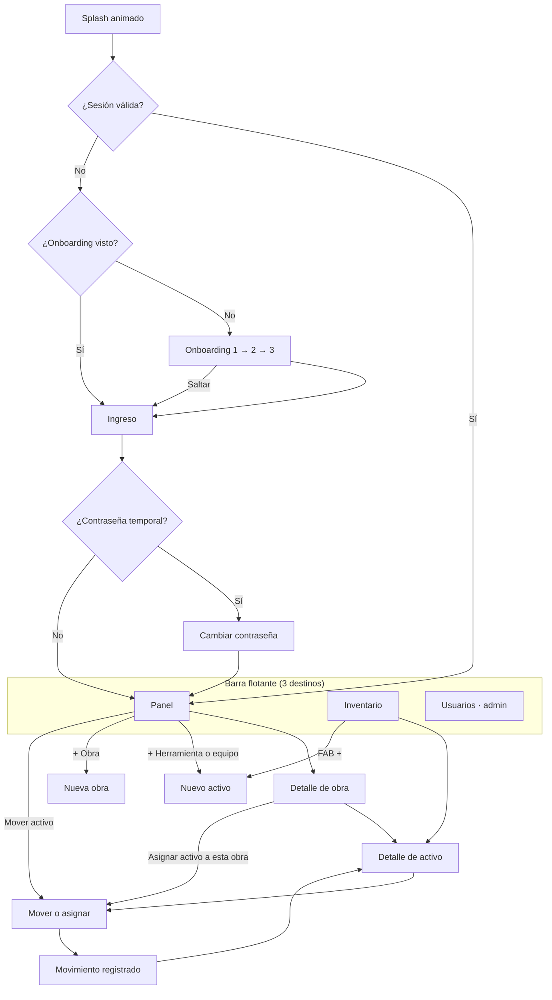

# 08 — Flujos de Experiencia

> Diseño de referencia: canvas <https://claude.ai/artifact/NSoVekPv3gJuHQjkXjqrpk>, página **Constructora A2C**. Cada pantalla de este documento corresponde a un artboard del canvas (columna "Artboard").

---

## 1. Mapa de pantallas

| #  | Pantalla                     | Artboard del canvas          | Ruta Flutter (`go_router`)     |
| -- | ---------------------------- | ---------------------------- | ------------------------------ |
| 1  | Splash animado               | `Splash-a2c`                 | `/splash`                      |
| 2  | Onboarding (3 pasos)         | `Onboarding-a2c` (1, 2, 3)   | `/onboarding`                  |
| 3  | Ingreso                      | `Login-a2c`                  | `/login`                       |
| 4  | Cambiar contraseña temporal  | — (por diseñar, Sprint 1)    | `/change-password`             |
| 5  | Panel en tiempo real         | `Main-a2c`                   | `/` (tab Obras)                |
| 6  | Detalle de obra / almacén    | `Obra-a2c`                   | `/sites/:id`                   |
| 7  | Detalle de activo            | `Activo-a2c`                 | `/assets/:id`                  |
| 8  | Mover o asignar              | `Mover-a2c`                  | `/move?assetId=&toSiteId=`     |
| 9  | Movimiento registrado        | — (por diseñar, Sprint 4)    | modal / tostada                |
| 10 | Inventario general           | `Inventario-a2c`             | `/inventory` (tab Inventario)  |
| 11 | Nueva herramienta o equipo   | `NuevoActivo-a2c`            | `/assets/new`                  |
| 12 | Nueva obra                   | `NuevaObra-a2c`              | `/sites/new`                   |
| 13 | Usuarios                     | `Usuarios-a2c`               | `/users` (tab Usuarios, solo admin) |

## 2. Navegación

- **Barra de navegación flotante** con 3 destinos (Obras, Inventario, Usuarios). El tab Usuarios solo aparece para `ADMIN`; el **operador** ve 2 destinos (Obras, Inventario).
- Acciones solo de administrador (ocultas para el operador): "+ Herramienta o equipo", "+ Obra", FAB del inventario, editar activo, cambiar estado, revertir.
- El botón "Salir" está en el encabezado del panel.
- Botón atrás del sistema (Android) respeta la pila; desde el panel, sale de la app.

## 3. Flujos clave

### 3.1 Primer uso

1. **Splash** (≈ 6,5 s de animación; se puede tocar para continuar). Mientras corre, la app verifica la sesión en segundo plano.
2. **Onboarding** — tarjetas reales de la app flotando:
   - Paso 1: "Cada herramienta y máquina, siempre ubicada".
   - Paso 2: "Mueve y asigna en segundos, con registro de quién y cuándo".
   - Paso 3: "Stock, estados e historial de cada activo, en tiempo real".
   - Botón amarillo "Continuar" / "Comenzar"; "Saltar ›" arriba a la derecha; puntos tocables.
3. **Ingreso** — DNI (teclado numérico) y contraseña → "Ingresar".
4. Si la contraseña es temporal → **cambiar contraseña** → panel.

**En usos posteriores:** splash breve (se corta cuando la sesión está verificada, mínimo 1,5 s) → panel.

### 3.2 Consultar disponibilidad (operador o administrador) — reemplaza las llamadas entre obras

1. Panel → buscador "Buscar herramienta, máquina u obra".
2. Escribe "pala" → cada resultado muestra el total y la **distribución**: "Pala de punta · 8 uds — Almacén central 6 · Obra Juan Ramírez 2".
3. Toca el resultado → detalle del activo con la barra de distribución por ubicación.
4. El operador ejecuta el traslado directamente desde ahí ("Mover o asignar"), **sin pedir aprobación**.

### 3.3 Mover o asignar un activo (operador · flujo principal)

| Paso | Pantalla             | Acción del usuario                              | Validación / feedback                                  |
| ---- | -------------------- | ----------------------------------------------- | ------------------------------------------------------ |
| 1    | Detalle de activo    | Toca **"Mover o asignar"**                       | —                                                      |
| 2    | Mover o asignar      | Elige **Desde** (cada opción muestra disponibles) | Solo ubicaciones con stock > 0                         |
| 3    |                      | Elige **Hacia**                                 | Excluye el origen y obras cerradas                     |
| 4    |                      | Ajusta **Cantidad** (− / +)                      | Herramienta: 1…disponible; Máquina: fija en 1 con candado |
| 5    |                      | Nota opcional                                   | Máx. 500 caracteres                                    |
| 5b   |                      | **Reportar observación** (opcional): Dañado, Incompleto, Faltante u Otro + descripción | Se registra el movimiento igual; el administrador la ve en "Observaciones abiertas" |
| 6    |                      | Revisa el resumen: "Mover 1 unidad de Almacén central a Obra Juan Ramírez." | Aviso si el activo está en Mantenimiento |
| 7    |                      | **"Confirmar movimiento"**                       | Botón con estado de carga; doble toque bloqueado       |
| 8    | Movimiento registrado| Ve la confirmación y vuelve al detalle          | El historial y el panel se actualizan                  |

**Meta:** ≤ 4 toques en el caso común (origen y destino precargados desde la obra).

**Errores:**
- `STOCK_INSUFICIENTE` → "Alguien movió unidades mientras tanto. Ahora hay N disponibles." y se actualiza el selector.
- Sin conexión → "Guardado. Se enviará cuando vuelva la señal." con chip "1 pendiente".

### 3.4 Alta de herramienta o equipo (administrador)

1. Panel → "+ Herramienta o equipo" (o FAB en Inventario).
2. Tipo: **Máquina** (unidad única) o **Herramienta** (por cantidad). El código se muestra como "Automático" (`MAQ-0022` / `HER-0143`).
3. Nombre, descripción, estado (Operativo / Mantenimiento / Baja).
4. Stock: Máquina → bloqueado en 1 con explicación; Herramienta → stepper.
5. Ubicación inicial (por defecto, Almacén central) → "Guardar en inventario".

### 3.5 Crear obra (administrador)

Nombre → Dueño → Ubicación (buscar dirección, ajustar pin) → "Crear obra" → detalle de la obra nueva.

### 3.6 Usuarios (administrador)

Lista → "+ Nuevo" (formulario en línea: DNI de 8 dígitos, nombre completo, contraseña inicial, rol Administrador u Operador) → Guardar. Desde un usuario: editar, restablecer contraseña (muestra la temporal una sola vez), desactivar.

## 4. Estados de interfaz

| Estado         | Tratamiento                                                                      |
| -------------- | -------------------------------------------------------------------------------- |
| Cargando       | Esqueletos (*skeletons*) con la forma de las tarjetas; nunca spinner a pantalla completa tras el primer ingreso |
| Vacío          | Ilustración simple + texto + acción ("Aún no hay obras" → "+ Obra")              |
| Sin resultados | "Sin resultados" + "Limpiar filtros"                                             |
| Error de red   | Banda superior "Sin conexión · datos de hace N min" + reintentar                 |
| Error de servidor | Mensaje humano + código de referencia (`requestId`) para soporte              |
| Pendiente      | Chip "N pendientes" en el panel; ítem del historial con ícono de reloj           |
| Observación abierta | Chip amarillo con ícono de alerta en el historial y en el activo; contador en el panel del administrador |
| Rechazado      | Tarjeta con el motivo y acción "Corregir"                                        |
| En vivo        | Punto amarillo "En vivo · hace 4 s" en el encabezado                              |
| Sin permiso    | La acción no se muestra; si se accede por enlace: "No tienes permiso para esto"  |

## 5. Microinteracciones

| Elemento                    | Comportamiento                                                     |
| --------------------------- | ------------------------------------------------------------------ |
| Tab activo                  | Píldora amarilla que se desplaza entre destinos (200 ms, ease-out) |
| Stepper de cantidad         | Vibración ligera (haptic) al llegar al mínimo/máximo               |
| Confirmar movimiento        | Botón → check animado → retorno                                    |
| Actualización en vivo       | La tarjeta que cambió destella suavemente (fondo amarillo 8 % → 0) |
| Deslizar para refrescar     | Indicador con el color de marca                                    |
| Onboarding                  | Tarjetas flotan hacia arriba al entrar; texto aparece con fundido  |

## 6. Accesibilidad

- Todos los íconos de acción con `Semantics(label: …)`; botones reales, áreas ≥ 48 dp.
- Orden de foco lógico; el splash anuncia "Constructora A2C, cargando".
- Sin depender solo del color: los estados llevan texto (Operativo, Mantenimiento, Baja).
- Soporte de texto grande hasta 130 % sin recortes (las tarjetas crecen en alto).
- "Reducir movimiento": sin animación de splash, onboarding sin desplazamientos.

## 7. Pantallas pendientes de diseño

| Pantalla                         | Sprint | Nota                                      |
| -------------------------------- | ------ | ----------------------------------------- |
| Cambiar contraseña temporal      | 1      | Mismo estilo del ingreso                  |
| Movimiento registrado            | 4      | Confirmación con resumen y "Ver historial" |
| Editar activo / cambiar estado   | 3      | Hoja inferior (*bottom sheet*)            |
| Detalle de usuario               | 1      | Acciones de admin                         |
| Estados vacíos y sin conexión    | 5–6    | Componentes reutilizables                 |
| Importación masiva               | 6      | Resultado por fila                        |
